<h1>
  
  Veritas AI: Universal Multi-Layer Deepfake Forensics System
</h1>


**Veritas AI** is a state-of-the-art, defense-in-depth forensics platform designed to detect AI-generated media (Deepfakes). Unlike single-model detectors, Veritas AI employs a **7-layer analysis pipeline** to scrutinize media from every angle—metadata, biology, physics, and mathematics.

```mermaid
graph TD
    %% Input
    Input[("🖼️ Suspicious Image/Video")]:::inputStyle

    %% Security Checkpoint
    Gate{Veritas AI Security Checkpoint}:::gateStyle

    %% 7 Layers of Defense
    subgraph Layers["🛡️ 7 Layers of Defense"]
        L1["1. Metadata & Provenance 📄<br><i>File headers, EXIF, C2PA manifests</i>"]:::layer
        L2["2. Biological Signals 🩺<br><i>rPPG pulse detection</i>"]:::layer
        L3["3. Mathematical Forensics 📐<br><i>FFT, DCT, frequency artifacts</i>"]:::layer
        L4["4. Hybrid AI Model 🤖<br><i>CNN + Transformer detecting anomalies</i>"]:::layer
        L5["5. Physics & Lighting 💡<br><i>Lighting & eye reflection consistency</i>"]:::layer
        L6["6. Early Signature Detection 🔬<br><i>Generative model fingerprints</i>"]:::layer
        L7["7. Error Level Analysis 🔍<br><i>Compression & splicing X-Ray</i>"]:::layer
    end

    %% Analysis & Verdict
    Analysis["🧠 Synthesis Engine<br><i>Combines all clues</i>"]:::analysis
    Verdict{{"✅ REAL or ❌ FAKE"}}:::verdict

    %% Connections
    Input --> Gate
    Gate --> L1 & L2 & L3 & L4 & L5 & L6 & L7
    L1 & L2 & L3 & L4 & L5 & L6 & L7 --> Analysis --> Verdict

    %% Styling
    classDef inputStyle fill:#e0f7fa,stroke:#00796b,stroke-width:2px,color:#000,font-weight:bold
    classDef gateStyle fill:#fff3e0,stroke:#f57c00,stroke-width:2px,color:#000,font-weight:bold
    classDef layer fill:#f1f8e9,stroke:#33691e,stroke-width:1px,color:#000
    classDef analysis fill:#e8eaf6,stroke:#3949ab,stroke-width:2px,color:#000,font-weight:bold
    classDef verdict fill:#fff9c4,stroke:#fbc02d,stroke-width:2px,color:#000,font-weight:bold

```

## 🛡️ The 7 Layers of Defense

1.  **Metadata & Provenance**: Analyzes file headers, EXIF data, and C2PA manifests for inconsistencies.
2.  **Biological Signals (rPPG)**: Detects the subtle color changes in human skin caused by blood flow (pulse), often missing in deepfakes.
3.  **Mathematical Forensics**: Uses FFT (Fast Fourier Transform) and DCT to reveal hidden frequency-domain artifacts and grid patterns.
4.  **Hybrid AI Model**: A dual-branch neural network (CNN + Transformer) detecting texture anomalies and semantic inconsistencies.
5.  **Physics & Lighting**: Checks for consistent lighting direction and eye reflection symmetry.
6.  **Early Signature Detection**: Identifies fingerprints of specific generative models (GANs, Diffusion).
7.  **Error Level Analysis (ELA)**: A visual "X-Ray" tool that highlights compression differences to detect splicing.

## 🚀 Features

*   **Universal Dashboard**: A minimalist, "Figma-style" web interface.
*   **Multi-Upload**: Batch process multiple images and videos simultaneously.
*   **Real-Time Webcam Mode**: Analyze your own face live in the browser.
*   **Detailed Visualizations**: Radar charts, spectral heatmaps, and pulse graphs.
*   **Exportable Reports**: Download comprehensive CSV reports of your analysis.
*   **Deployment Ready**: Configured for Vercel and Docker.

## 🛠️ Installation

### Prerequisites
*   Python 3.9+
*   Node.js 16+
*   Git

### 1. Clone the Repository
```bash
git clone https://github.com/yourusername/veritas-ai.git
cd veritas-ai
```

### 2. Backend Setup
```bash
cd backend
python -m venv venv
# Windows
.\venv\Scripts\activate
# Mac/Linux
source venv/bin/activate

pip install -r requirements.txt
python -m uvicorn app.main:app --reload
```
*Backend runs on `http://localhost:8000`*

### 3. Frontend Setup
```bash
cd frontend
npm install
npm run dev
```
*Frontend runs on `http://localhost:3000`*

## 📖 Usage

1.  Open the dashboard at `http://localhost:3000`.
2.  **Upload Analysis**: Drag and drop images or videos. The system will process them through all 7 layers.
3.  **View Results**: Click on a file to see the detailed breakdown.
    *   **Verdict**: Real vs. AI-Generated.
    *   **Confidence**: Probability score.
    *   **ELA**: Toggle the "Eye" icon to see the Error Level Analysis X-Ray.
4.  **Live Webcam**: Switch to the "Live Webcam" tab to test the rPPG engine in real-time.

## 🏗️ Technology Stack

*   **Backend**: FastAPI, PyTorch, OpenCV, NumPy, SciPy
*   **Frontend**: Next.js, TypeScript, Tailwind CSS, Chart.js, Lucide React
*   **Deployment**: Docker, Vercel

## 📄 License

MIT License. See [LICENSE](LICENSE) for details.
