# Veritas AI: The Deepfake Defense System
## A Simple Guide for Everyone

### The Problem
In a world where AI can create fake faces and voices in seconds, how do we know what's real? **Veritas AI** is the answer.

### How It Works: "The 6 Security Guards"
Think of Veritas AI not as a single computer program, but as a **high-security checkpoint** with 6 different experts. A fake image might fool one of them, but it won't fool all of them.

```mermaid
graph TD
    Input[("🖼️ Suspicious Image/Video")] --> Gate{Veritas AI Security Checkpoint}
    
    subgraph "The 6 Layers of Defense"
        G1["1. The ID Checker 🪪<br>(Checks file history & digital signature)"]
        G2["2. The Doctor 🩺<br>(Checks for a human heartbeat/pulse)"]
        G3["3. The Mathematician 📐<br>(Finds invisible pixel patterns)"]
        G4["4. The Detective 🕵️<br>(AI trained to spot other AI)"]
        G5["5. The Physicist 💡<br>(Checks if lighting & shadows make sense)"]
        G6["6. The Specialist 🔬<br>(Looks for specific 'fingerprints' of AI tools)"]
    end
    
    Gate --> G1 & G2 & G3 & G4 & G5 & G6
    
    G1 & G2 & G3 & G4 & G5 & G6 --> Analysis["🧠 Synthesis Engine<br>(Combines all clues)"]
    
    Analysis --> Verdict{{"✅ REAL or ❌ FAKE"}}
    
    style Input fill:#f9f,stroke:#333,stroke-width:2px
    style Verdict fill:#bbf,stroke:#333,stroke-width:2px,color:black
```

### The 6 Layers Explained Simply

1.  **The ID Checker (Metadata):**
    *   *What it does:* Looks at the digital "paperwork" inside the file.
    *   *Real Life:* Like checking a passport. If the ID says "Born Yesterday" or is written in crayon (missing data), it's suspicious.

2.  **The Doctor (Biological Signals):**
    *   *What it does:* Uses a camera to detect the tiny color changes in skin that happen when a heart beats.
    *   *Real Life:* Real people have a pulse. Deepfakes are just pixels; they don't have a heartbeat.

3.  **The Mathematician (Math Forensics):**
    *   *What it does:* Looks at the raw numbers behind the image.
    *   *Real Life:* AI generators leave specific mathematical patterns, like a "grid" or "checkerboard," that human eyes can't see but math can prove.

4.  **The Detective (Hybrid AI Model):**
    *   *What it does:* An AI trained specifically to catch other AIs.
    *   *Real Life:* It knows that AI often messes up hair strands, ears, or background text. It spots the "blur" that shouldn't be there.

5.  **The Physicist (Lighting & Physics):**
    *   *What it does:* Checks if the light on the face matches the light in the background.
    *   *Real Life:* If the sun is on the left, the shadow must be on the right. AI often forgets these rules of physics.

6.  **The Specialist (Early Signatures):**
    *   *What it does:* Looks for the specific "style" of known fake generators (like Midjourney or DALL-E).
    *   *Real Life:* Like an art expert recognizing a painter's brushstroke.

### The Result
Veritas AI gives you a simple **% Confidence Score**.
*   **0-30%:** Likely Real.
*   **70-100%:** Likely Fake.

---
*Veritas AI: Trust, Verified.*
